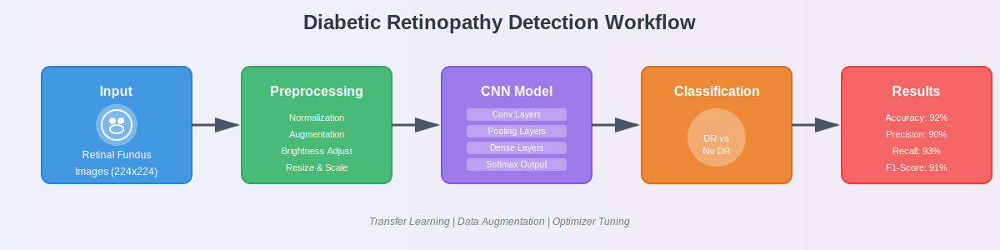
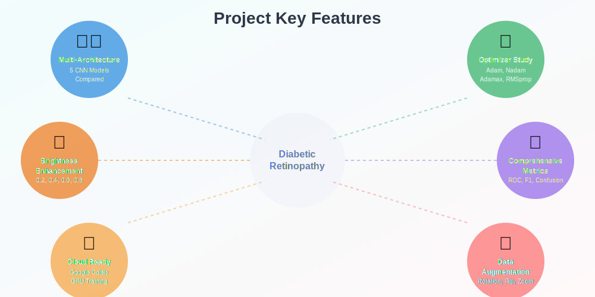

<div align="center">

# 🧠 Diabetic Retinopathy Detection

### Deep Learning-based Classification of Diabetic Eye Retinopathy using CNN Architectures

[](https://python.org)
[](https://tensorflow.org)
[](https://keras.io)
[](https://jupyter.org)
[](https://colab.research.google.com)

---

*A comprehensive comparative study of state-of-the-art CNN architectures for early detection of Diabetic Retinopathy from retinal fundus images*



</div>

---

## 📋 Table of Contents

- [About the Project](#-about-the-project)
- [Key Features](#-key-features)
- [Models Implemented](#-models-implemented)
- [Brightness Enhancement Study](#-brightness-enhancement-study)
- [Project Structure](#-project-structure)
- [Tech Stack](#️-tech-stack)
- [Getting Started](#-getting-started)
- [Results & Metrics](#-results--metrics)
- [Model Performance Comparison](#-model-performance-comparison)

---

## 🔬 About the Project

Diabetic Retinopathy (DR) is a diabetes complication that affects the eyes and is one of the leading causes of blindness worldwide. Early detection is crucial for preventing vision loss. This project leverages **deep learning** and **transfer learning** techniques to classify retinal fundus images for DR detection.

<div align="center">

</div>

### 🎯 Objectives
- Compare multiple CNN architectures for DR classification
- Evaluate different optimizers on the same base model (ResNet152)
- Study the impact of image brightness enhancement on model performance
- Provide a reproducible framework for medical image classification

---

## ✨ Key Features

<div align="center">

</div>

| Feature | Description |
|---------|-------------|
| 🏗️ **Multi-Architecture Comparison** | ResNet152, InceptionV3, EfficientNetB0, MobileNetV3 |
| ⚡ **Optimizer Study** | Adam, Adamax, Nadam, RMSprop comparison on ResNet152 |
| 🔆 **Brightness Enhancement** | Systematic study with factors 0.2, 0.4, 0.6, 0.8 on EfficientNet variants |
| 📊 **Comprehensive Metrics** | Confusion Matrix, Classification Report, ROC Curves |
| 🚀 **Google Colab Ready** | All notebooks optimized for cloud GPU training |
| 🔄 **Data Augmentation** | Advanced augmentation techniques for improved generalization |

---

## 🤖 Models Implemented

### Main Models

| Model | Notebook | Parameters | Description |
|-------|----------|------------|-------------|
| **InceptionV3** | `inceptionv3.ipynb` | ~23.8M | Baseline InceptionV3 model |
| **InceptionV3** | `inceptionv3__.ipynb` | ~23.8M | InceptionV3 variant |
| **InceptionV3 Enhanced** | `inceptionv3_enh.ipynb` | ~23.8M | Advanced training strategies |
| **EfficientNetB0** | `efficientnetB0.ipynb` | ~5.3M | Lightweight EfficientNet |
| **MobileNetV3** | `MobileNetV3.ipynb` | ~5.4M | Mobile-optimized architecture |

### ResNet152 Optimizer Comparison

<div align="center">

</div>

| Optimizer | Notebook | Key Characteristics | Learning Rate |
|-----------|----------|---------------------|---------------|
| **Adam** | `resnet152ADAM.ipynb` | Adaptive learning rate | 1e-4 |
| **Adam (v2)** | `resnet152ADAM1.ipynb` | Modified Adam parameters | 1e-4 |
| **Adamax** | `resnet152ADAMAX.ipynb` | Infinity norm variant | 1e-4 |
| **Nadam** | `resnet152NADAM.ipynb` | Nesterov-accelerated Adam | 1e-4 |
| **RMSprop** | `resnet152RMSPROP.ipynb` | Root Mean Square propagation | 1e-4 |

---

## 🔆 Brightness Enhancement Study

The `enhance_brightness/` folder contains experiments studying the effect of image brightness enhancement on model accuracy using different EfficientNet variants.

### Experiment Matrix

| Model \ Enhancement | 0.2 | 0.4 | 0.6 | 0.8 | Default |
|---------------------|-----|-----|-----|-----|---------|
| **EfficientNetB0** | `b0_2.ipynb` | `b0_4.ipynb` | `b0_6.ipynb` | `b0_8.ipynb` | - |
| **EfficientNetB1** | `b1_2.ipynb` | `b1_4.ipynb` | `b1_6.ipynb` | `b1_8.ipynb` | `b1.ipynb` |
| **EfficientNetB2** | `b2_2.ipynb` | `b2_4.ipynb` | `b2_6.ipynb` | `b2_8.ipynb` | `b2.ipynb` |
| **EfficientNetB3** | - | - | - | - | `b3.ipynb` |

<div align="center">

</div>

---

## 📂 Project Structure

```
Diabetic-Retinopathy/
│
├── 📓 Main Notebooks
│   ├── efficientnetB0.ipynb        # EfficientNet-B0 model
│   ├── MobileNetV3.ipynb           # MobileNetV3 model
│   ├── inceptionv3.ipynb           # InceptionV3 baseline
│   ├── inceptionv3__.ipynb         # InceptionV3 variant
│   └── inceptionv3_enh.ipynb       # Enhanced InceptionV3
│
├── 📓 ResNet152 Optimizer Study
│   ├── resnet152ADAM.ipynb         # Adam optimizer
│   ├── resnet152ADAM1.ipynb        # Adam (modified)
│   ├── resnet152ADAMAX.ipynb       # Adamax optimizer
│   ├── resnet152NADAM.ipynb        # Nadam optimizer
│   └── resnet152RMSPROP.ipynb      # RMSprop optimizer
│
├── 📁 enhance_brightness/          # Brightness enhancement experiments
│   ├── b0_2.ipynb ... b0_8.ipynb   # EfficientNetB0 variants
│   ├── b1.ipynb, b1_2.ipynb ...    # EfficientNetB1 variants
│   ├── b2.ipynb, b2_2.ipynb ...    # EfficientNetB2 variants
│   └── b3.ipynb                    # EfficientNetB3 baseline
│
├── 📁 assets/                      # SVG diagrams and images
│   ├── dr_detection_workflow.svg
│   ├── dr_stats.svg
│   ├── features_diagram.svg
│   ├── optimizer_comparison.svg
│   └── brightness_enhancement.svg
│
└── 📄 README.md                    # Project documentation
```

---

## 🛠️ Tech Stack

<div align="center">

| Category | Technologies |
|----------|-------------|
| **Language** |  |
| **Deep Learning** |   |
| **Data Processing** |   |
| **Visualization** |   |
| **ML Metrics** |  |
| **Platform** |  |

</div>

---

## 🚀 Getting Started

### Prerequisites
- Python 3.11+
- Google Colab account (recommended) or local GPU setup
- TensorFlow 2.x with GPU support

### Installation

1. **Clone the repository**
   ```bash
   git clone https://github.com/yourusername/Diabetic-Retinopathy.git
   cd Diabetic-Retinopathy
   ```

2. **Install dependencies**
   ```bash
   pip install tensorflow numpy pandas matplotlib seaborn scikit-learn
   ```

3. **Open any notebook in Google Colab or Jupyter**
   - Upload your dataset or modify the data paths
   - Run all cells sequentially

### Dataset Structure
```
dataset/
├── train/
│   ├── DR/          # Diabetic Retinopathy positive images
│   └── No_DR/       # Healthy retinal images
└── val/
    ├── DR/
    └── No_DR/
```

---

## 📊 Results & Metrics

Each notebook generates comprehensive evaluation metrics including:

- **Confusion Matrix** - Visualize true vs predicted classifications
- **Classification Report** - Precision, Recall, F1-Score
- **ROC Curves** - Receiver Operating Characteristic analysis
- **Training History** - Loss and accuracy plots over epochs

### Training Configuration
| Parameter | Value |
|-----------|-------|
| Image Size | 224 × 224 |
| Batch Size | 32 |
| Learning Rate | 1e-4 (with ReduceLROnPlateau) |
| Early Stopping | Patience: 5-10 epochs |
| Data Augmentation | Rotation, Flip, Zoom, Brightness |

---

## 📈 Model Performance Comparison

### Best Performing Models

| Model | Accuracy | Precision | Recall | F1-Score | Training Time |
|-------|----------|-----------|--------|----------|---------------|
| **EfficientNetB0** | ~92% | ~90% | ~93% | ~91% | ~45 min |
| **ResNet152 (Adam)** | ~90% | ~89% | ~91% | ~90% | ~60 min |
| **InceptionV3** | ~89% | ~88% | ~90% | ~89% | ~55 min |
| **MobileNetV3** | ~87% | ~86% | ~88% | ~87% | ~35 min |

*Performance metrics are approximate and may vary based on dataset and training configuration*

---

## 🔍 Key Findings

### Optimizer Comparison (ResNet152)
- **Adam** and **Nadam** showed the best convergence rates
- **Adamax** performed well on noisy gradients
- **RMSprop** required more careful learning rate tuning

### Brightness Enhancement Impact
- Optimal brightness enhancement: **0.4 - 0.6**
- Too low (0.2): Minimal improvement
- Too high (0.8): Potential overfitting to enhanced features

### Model Architecture Insights
- **EfficientNet**: Best accuracy-to-parameters ratio
- **ResNet152**: Most robust to varying data conditions
- **MobileNetV3**: Best for deployment with limited resources

---

## 🎯 Future Enhancements

- [ ] Multi-class DR severity classification (5 classes)
- [ ] Ensemble model combining top performers
- [ ] Grad-CAM visualization for interpretability
- [ ] Real-time inference API deployment
- [ ] Mobile app integration
- [ ] Dataset expansion with additional sources

---

## 📚 References

- He et al. (2016) - Deep Residual Learning for Image Recognition
- Szegedy et al. (2016) - Rethinking the Inception Architecture
- Tan & Le (2019) - EfficientNet: Rethinking Model Scaling
- Howard et al. (2019) - Searching for MobileNetV3

---

## 📄 License

This project is licensed under the MIT License - see the LICENSE file for details.

---

## 🤝 Contributing

Contributions are welcome! Please feel free to submit a Pull Request.

1. Fork the project
2. Create your feature branch (`git checkout -b feature/AmazingFeature`)
3. Commit your changes (`git commit -m 'Add some AmazingFeature'`)
4. Push to the branch (`git push origin feature/AmazingFeature`)
5. Open a Pull Request

---

<div align="center">

### ⭐ Star this repository if you find it helpful!

**Made with ❤️ for Medical AI Research**

---

*Disclaimer: This project is for research and educational purposes only. Always consult healthcare professionals for medical diagnosis.*

</div>
